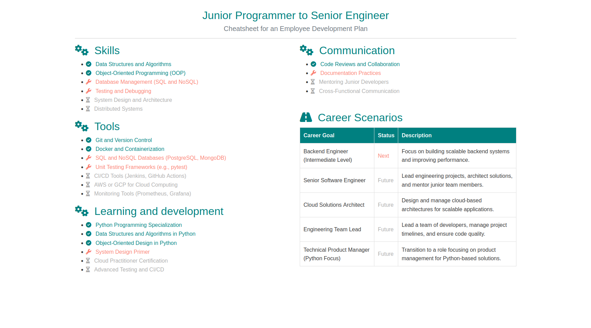

# Cheatsheet Generator

This tool generates a customized HTML cheatsheet to support employee development and career transitions. Using a Jinja2 HTML template and a JSON configuration file, it produces a structured cheatsheet with sections for skills, tools, learning and development, communication, and career scenarios.


*Fig. Example resulting cheatsheet.*

## Features

- **Configurable**: Define the skills, tools, and career paths tailored to an employee’s specific development needs.
- **Flexible**: Use any compatible Jinja2 HTML template and JSON configuration file to create different cheatsheets.
- **Easy to Use**: Run the script with a single command and generate a tailored HTML output file.

## Prerequisites

Ensure you have Python 3 installed with the following required packages:
- **Jinja2**

Install dependencies using:
```bash
pip install -r requirements.txt
```

## Usage

Run the script with the path to the configuration file. You can also specify the template file (defaults provided) and an output filename:

```bash
python3 generate_cheatsheet.py --config examples/junior_programmer_senior.json
```

### Arguments

- `--template`: (Optional) Path to the Jinja2 template file. Defaults to `templates/simple_template.html`.
- `--config`: Path to the JSON configuration file defining the employee development plan.
- `--output`: (Optional) Name of the output HTML file. Defaults to `mentor_mentee_cheatsheet.html`.

### Example Command

To generate a cheatsheet for a Junior Python Programmer transitioning to a Senior Engineer role:

```bash
python3 generate_cheatsheet.py --config examples/junior_programmer_senior.json
```

This will produce an HTML cheatsheet based on the provided configuration.

## License

This project is open-source and available under the MIT License.
